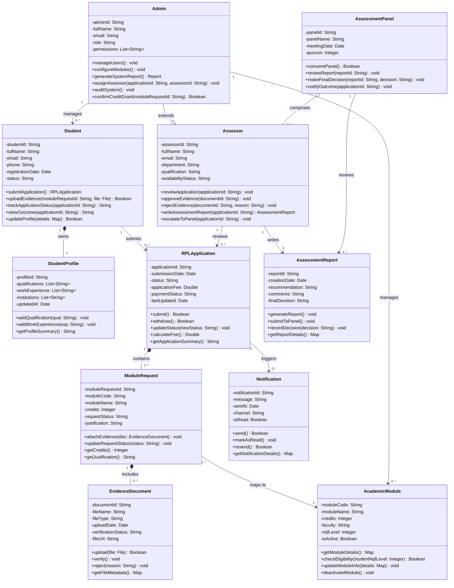

# Assignment 9: Domain Modeling and Class Diagram Development
## Recognition of Prior Learning (RPL) System

---

## Table of Contents
1. [Domain Model](#1-domain-model)
2. [Class Diagram in Mermaid.js](#2-class-diagram-in-mermaidjs)
3. [Design Decisions](#3-key-design-decisions)
4. [Reflection](#4-reflection)

---

## 1. Domain Model

### Overview

The RPL (Recognition of Prior Learning) System enables students to submit applications for academic credit based on prior qualifications, work experience, or informal learning. The domain model identifies the core entities, their attributes, responsibilities, and relationships that govern the system's business logic.

---

### 1.1 Domain Entities

| Entity | Attributes | Methods / Responsibilities | Relationships |
|---|---|---|---|
| **Student** | `studentId`, `fullName`, `email`, `phone`, `registrationDate`, `status` | `submitApplication()`, `uploadEvidence()`, `trackApplicationStatus()`, `viewOutcome()` | Submits one or more `RPLApplication`; has one `StudentProfile` |
| **RPLApplication** | `applicationId`, `submissionDate`, `status`, `applicationFee`, `paymentStatus` | `submit()`, `withdraw()`, `updateStatus()`, `calculateFee()` | Belongs to one `Student`; contains one or more `ModuleRequest`; reviewed by one `Assessor`; goes through `AssessmentPanel` |
| **ModuleRequest** | `moduleRequestId`, `moduleCode`, `moduleName`, `credits`, `requestStatus`, `justification` | `attachEvidence()`, `updateRequestStatus()`, `getCredits()` | Part of one `RPLApplication`; linked to one or more `EvidenceDocument`; mapped to one `AcademicModule` |
| **EvidenceDocument** | `documentId`, `fileName`, `fileType`, `uploadDate`, `verificationStatus`, `fileUrl` | `upload()`, `verify()`, `reject()`, `getFileMetadata()` | Attached to one `ModuleRequest`; verified by an `Assessor` |
| **Assessor** | `assessorId`, `fullName`, `email`, `department`, `qualification`, `availabilityStatus` | `reviewApplication()`, `approveEvidence()`, `rejectEvidence()`, `writeAssessmentReport()`, `escalateToPanel()` | Reviews one or more `RPLApplication`; part of `AssessmentPanel`; generates `AssessmentReport` |
| **AssessmentReport** | `reportId`, `creationDate`, `recommendation`, `comments`, `finalDecision` | `generateReport()`, `submitToPanel()`, `recordDecision()` | Created by `Assessor`; associated with one `RPLApplication`; reviewed by `AssessmentPanel` |
| **AssessmentPanel** | `panelId`, `panelName`, `meetingDate`, `quorum` | `convenePanel()`, `reviewReport()`, `makeFinalDecision()`, `notifyOutcome()` | Comprises multiple `Assessor` members; reviews `AssessmentReport`; issues `Outcome` |
| **AcademicModule** | `moduleCode`, `moduleName`, `credits`, `faculty`, `nqfLevel`, `isActive` | `getModuleDetails()`, `checkEligibility()`, `updateModuleInfo()` | Mapped from `ModuleRequest`; managed by `Admin` |
| **Notification** | `notificationId`, `message`, `sentAt`, `channel`, `isRead` | `send()`, `markAsRead()`, `resend()` | Sent to `Student` or `Assessor`; triggered by status changes in `RPLApplication` |
| **Admin** | `adminId`, `fullName`, `email`, `role`, `permissions` | `manageUsers()`, `configureModules()`, `generateReports()`, `assignAssessor()`, `auditSystem()` | Manages `AcademicModule`, `Student`, `Assessor`; oversees `RPLApplication` |

---

### 1.2 Business Rules

| Rule ID | Business Rule | Related Entity |
|---|---|---|
| BR-001 | A student may submit a maximum of **3 active RPL applications** simultaneously. | `Student`, `RPLApplication` |
| BR-002 | Each `RPLApplication` must contain **at least one** `ModuleRequest` before submission. | `RPLApplication`, `ModuleRequest` |
| BR-003 | An `EvidenceDocument` must be **verified** before a `ModuleRequest` can be approved. | `EvidenceDocument`, `ModuleRequest` |
| BR-004 | An `RPLApplication` can only be **withdrawn** while in `Pending` or `UnderReview` status. | `RPLApplication` |
| BR-005 | An `AssessmentPanel` requires a **quorum of at least 3 assessors** to make a final decision. | `AssessmentPanel`, `Assessor` |
| BR-006 | A `Notification` must be sent to the student upon **every status change** of their application. | `Notification`, `RPLApplication` |
| BR-007 | Each `ModuleRequest` may only request credits for modules at the **student's enrolled NQF level or below**. | `ModuleRequest`, `AcademicModule` |
| BR-008 | An `Assessor` **cannot review** an application submitted by a student in their own department. | `Assessor`, `RPLApplication` |
| BR-009 | The `AssessmentReport` must be completed **within 15 working days** of application submission. | `AssessmentReport` |
| BR-010 | An approved `ModuleRequest` grants credits **only after Admin confirmation** and system update. | `ModuleRequest`, `Admin` |

---

### 1.3 Entity Relationships Summary

- **Student** *submits* one or more **RPLApplication** (1 to 0..*)
- **RPLApplication** *contains* one or more **ModuleRequest** (1 to 1..*)
- **ModuleRequest** *has* zero or more **EvidenceDocument** (1 to 0..*)
- **ModuleRequest** *maps to* one **AcademicModule** (many to 1)
- **Assessor** *reviews* one or more **RPLApplication** (1..* to 0..*)
- **Assessor** *creates* one **AssessmentReport** per application (1 to 1)
- **AssessmentPanel** *comprises* multiple **Assessors** (1 to 3..*)
- **AssessmentPanel** *reviews* one or more **AssessmentReport** (1 to 1..*)
- **Notification** *is sent to* **Student** or **Assessor** (0..* to 1)
- **Admin** *manages* **AcademicModule**, **Student**, **Assessor** (1 to 0..*)

---

## 2. Class Diagram in Mermaid.js

---

## 3. Key Design Decisions

### 3.1 Inheritance: Admin extends Assessor
The `Admin` class inherits from `Assessor` because an administrator in an RPL system is typically a senior assessor with additional privileges. This avoids duplication of attributes such as `fullName`, `email`, and `department`, while extending functionality to include user management, module configuration, and audit capabilities. This aligns with the **Open/Closed Principle** — the `Assessor` base class remains closed for modification while being open for extension.

### 3.2 Composition for RPLApplication → ModuleRequest → EvidenceDocument
Strong composition is used here because:
- A `ModuleRequest` has no meaningful existence outside an `RPLApplication`.
- An `EvidenceDocument` is always specific to a `ModuleRequest`.
- If an application is deleted, all its module requests and evidence are deleted too.
This mirrors real-world RPL business logic and prevents orphaned records.

### 3.3 Aggregation: AssessmentPanel ◇— Assessor
`AssessmentPanel` aggregates `Assessors` because an assessor can exist independently of any particular panel and may serve on multiple panels over time. This is weaker ownership than composition — panels are formed temporarily for deliberation, and assessors retain their own lifecycle.

### 3.4 Notification as a Standalone Class
Rather than embedding notification logic inside `Student` or `RPLApplication`, `Notification` is modelled as a standalone class. This supports the **Single Responsibility Principle** and allows multiple channels (email, SMS, in-app) to be managed centrally. It also aligns with FR (Functional Requirement) for automated notifications on status changes.

### 3.5 StudentProfile Separated from Student
Student demographic data (qualifications, work experience) is separated into `StudentProfile` to avoid bloating the `Student` class. This separation supports the RPL-specific need for rich prior learning documentation without coupling it to authentication and application tracking logic.

### 3.6 AcademicModule as a Reference Entity
`AcademicModule` acts as a reference/lookup entity — it is managed by `Admin` and referenced by `ModuleRequest`. This ensures all credit claims are traceable to formally registered academic modules, enforcing the NQF (National Qualifications Framework) alignment required by BR-007.

---

## 4. Reflection

### 4.1 Introduction

Designing the domain model and class diagram for the RPL (Recognition of Prior Learning) system was both a challenging and deeply instructive exercise. It required translating a complex, bureaucratic academic process into a clean object-oriented structure that respects real-world rules, stakeholder needs, and prior system design decisions. This reflection examines the challenges encountered, the alignment with previous assignments, trade-offs made, and key lessons learned.

---

### 4.2 Challenges Faced

**Abstraction and Boundary Drawing**

One of the most difficult aspects of designing the domain model was deciding what belonged inside the system boundary and what was external. For instance, the RPL process involves communication with external academic registries and national qualifications bodies (such as the South African Qualifications Authority — SAQA). Including these as full domain entities would have overcomplicated the class diagram, yet ignoring them completely would have left gaps in the model. The decision was made to represent these as boundary interactions (through `Admin` and `AcademicModule`) rather than modelling them as full entities, which simplified the design without losing critical traceability.

**Identifying the Right Granularity**

Deciding how much detail to include in each class was a recurring challenge. For example, the `RPLApplication` class could have held evidence, module requests, and reports all within itself — but this would have created a God Object antipattern. Breaking these into separate classes (`ModuleRequest`, `EvidenceDocument`, `AssessmentReport`) required careful thought about responsibilities and single-purpose design. Conversely, over-decomposition was also a risk: splitting `Student` from `StudentProfile` needed clear justification, which was found in the different lifecycles and responsibilities of the two entities.

**Modelling the Assessment Workflow**

The RPL assessment process is multi-layered: an individual assessor reviews an application and writes a report, which is then reviewed by a panel that makes the final decision. Mapping this correctly required understanding the distinction between composition (report belongs to one assessor's review) and aggregation (panel comprises multiple assessors who retain independent existence). Getting this wrong would have produced an inaccurate UML model that misrepresents the real workflow.

**Inheritance vs. Composition for Admin**

Deciding whether `Admin` should extend `Assessor` (inheritance) or hold a reference to an assessor role (composition) was a significant trade-off. Inheritance was chosen because the RPL system context naturally implies an admin is a senior assessor with elevated rights — not merely someone who uses assessor services. However, this decision was made cautiously, acknowledging that in a more complex system, a role-based access control model using composition and interfaces might be more flexible.

---

### 4.3 Alignment with Previous Assignments

**Alignment with Assignment 4 (Functional Requirements)**

The domain entities map directly to the functional requirements identified in Assignment 4. For example:
- FR requiring students to submit applications → `Student.submitApplication()` and the `RPLApplication` class.
- FR requiring evidence upload and verification → `EvidenceDocument.upload()` and `EvidenceDocument.verify()`.
- FR requiring notifications on status change → the standalone `Notification` class.
- FR requiring admin to assign assessors → `Admin.assignAssessor()`.

Business rules such as BR-001 (maximum 3 active applications) and BR-008 (assessors cannot review applications from their own department) are directly captured as enforced method-level logic within `RPLApplication` and `Assessor`.

**Alignment with Assignment 5 (Use Cases)**

The use cases from Assignment 5 are fully reflected in the class diagram's methods. For instance:
- "Submit RPL Application" use case → `Student.submitApplication()` → `RPLApplication.submit()`
- "Review Application" use case → `Assessor.reviewApplication()` → `AssessmentReport.generateReport()`
- "Panel Decision" use case → `AssessmentPanel.makeFinalDecision()` → `Notification.send()`

Each actor from the use case diagram (Student, Assessor, Admin, Panel) corresponds to a class in this diagram, ensuring direct traceability.

**Alignment with Assignment 8 (State and Activity Diagrams)**

The state transitions modelled in Assignment 8 (e.g., `RPLApplication` moving from `Pending → UnderReview → Approved/Rejected`) are reflected in the `status` attribute and `updateStatus()` method of `RPLApplication`. Similarly, the activity diagrams for workflows like "Upload Evidence" and "Assessor Review" correspond directly to the method chains visible in this class diagram, confirming behavioural-structural consistency.

---

### 4.4 Trade-offs Made

| Trade-off | Decision Made | Justification |
|---|---|---|
| Inheritance vs. Composition for Admin | Chose inheritance | Admin is a specialisation of Assessor; avoids attribute duplication |
| Separate `StudentProfile` vs. one fat `Student` class | Separation | Cleaner SRP; different lifecycles for authentication vs. prior learning data |
| Embedding notification logic vs. standalone `Notification` class | Standalone class | Supports multiple channels; easier to extend and test independently |
| Detailed payment class vs. payment attributes on `RPLApplication` | Attributes only | Payment is simple in RPL; a full `Payment` class would over-engineer the model |
| Modelling SAQA/external bodies vs. excluding them | Excluded as full entities | They are external systems; modelling them as domain classes adds unnecessary complexity |

---

### 4.5 Lessons Learned

**Object-Oriented Design Principles Apply at the Model Level**

This assignment reinforced that OOP principles — Single Responsibility, Open/Closed, Liskov Substitution — are not just coding concerns. They apply at the modelling level. Designing `Notification` as its own class, for instance, is an architectural decision rooted in SRP long before any code is written.

**Domain Models Drive Design Quality**

Beginning with the domain model before the class diagram proved invaluable. Identifying entities, attributes, and business rules first gave the class diagram a principled foundation rather than an ad hoc structure. The domain model acted as a contract that the class diagram had to honour.

**UML Relationships Must Reflect Reality**

The distinction between association, aggregation, and composition is not merely syntactic — it reflects real-world lifecycle dependencies. Getting these right (e.g., using composition for `ModuleRequest` within `RPLApplication`) ensures that the class diagram communicates intended system behaviour accurately to developers and stakeholders.

**Traceability Is a First-Class Concern**

One of the most valuable insights from this assignment was the importance of traceability — every class, method, and relationship should be justifiable by reference to a requirement, use case, or business rule. This discipline prevents scope creep and ensures that the design remains purposeful.

**Balancing Completeness and Readability**

A final lesson was learning to balance completeness against readability. An exhaustive model capturing every edge case can become unreadable. Strategic simplification — such as keeping payment as attributes rather than a separate class — keeps the diagram accessible without sacrificing meaningful accuracy.

---

### 4.6 Conclusion

Assignment 9 brought the RPL system's design to a new level of structural clarity. The domain model and class diagram now provide a shared language between stakeholders, analysts, and developers. The challenges faced — particularly around abstraction, relationship types, and inheritance decisions — deepened my understanding of object-oriented design as a discipline that demands both technical rigour and domain knowledge. Looking ahead, this class diagram will form the foundation for database schema design and system implementation in subsequent phases of the project.

---

*End of Assignment 9 — RPL System Domain Model and Class Diagram*
